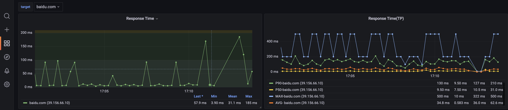

# Ping Exporter

> 简易的用于监控特定网站响应时间，将结果以 Prometheus 格式输出的工具



## 快速使用

- docker

```bash
docker run -it --name ping-exporter -p 9001:9001 -v $(pwd)/config.yaml:/app/config.yaml hellowoodes/ping-exporter
```

- docker-compose

```bash
git clone https://github.com/helloworlde/ping-exporter.git
cd ping-exporter

docker-compose up 
```
